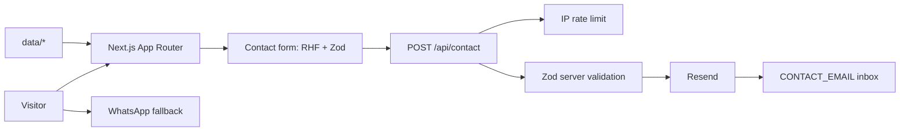

# Trak-Acessoria

One-page landing site for an art-market consultancy, built with Next.js 16 and the App Router.

[](https://github.com/tavinholoco/Trak-Acessoria/actions/workflows/ci.yml)


**English** | [Português](README.pt-BR.md)

**Live site:** https://trak-assessoria.vercel.app

## Table of Contents

- [Preview](#preview)
- [About](#about)
- [Features](#features)
- [Tech Stack](#tech-stack)
- [Architecture](#architecture)
- [Project Structure](#project-structure)
- [Getting Started](#getting-started)
- [Scripts](#scripts)
- [Tests](#tests)
- [Deploy](#deploy)
- [Roadmap](#roadmap)
- [License](#license)
- [Author](#author)

## Preview

| Dark theme (default) | Light theme |
| --- | --- |
|  |  |


## About

Art businesses (galleries, studios, cultural producers, curators and artists who run
themselves as a company) rarely lack talent. What they lack is commercial structure:
someone to position the brand, run the outreach and win public funding calls. Trak
Assessoria is the consultancy that sells exactly that, and this repository is its
landing page.

The page has one job: turn a visitor into a conversation. Everything sits on a single
scroll, split into numbered poster blocks (services, cases with metrics, team, FAQ and
contact), so a lead can read the whole offer top to bottom and reach the form without
ever changing pages. The contact form validates in the browser and again on the server,
sends through Resend, and falls back to WhatsApp when email is not an option.

The visual language is deliberately editorial and loud: oversized Fraunces display type,
an infinite marquee, color blocking per section and hand-drawn SVG illustrations. That
looseness is held in check by the engineering around it, with strict TypeScript, a
coverage gate, WCAG AA audits inside the end-to-end suite and a CSP declared in
`next.config.ts`.

This is a personal portfolio project. The company, its people, the metrics, the email
address and the phone number are all fictional demo data. The full product specification
lives in [`PRD.md`](PRD.md).

## Features

- One-page navigation by anchors: Início, Serviços, Projetos, Equipe, Contato.
- Numbered poster sections (03 to 07): a six-service grid, cases with headline metrics,
  an editorial team list, an FAQ accordion and the contact block.
- Contact form with Zod validation on both the client and the server, delivery through
  Resend, per-IP rate limiting and toast feedback.
- WhatsApp button as a fallback channel, opening with a prefilled message.
- Dark mode as the default, persisted across visits, with the whole page kept dark:
  neutral sections shift by one discreet step and the rhythm comes from the brand color.
- Motion that respects `prefers-reduced-motion`: marquee, light parallax, exaggerated
  hover states and reveal on scroll.
- Technical SEO: metadata, Open Graph and Twitter cards, generated `sitemap.xml` and
  `robots.txt`, plus JSON-LD structured data (Organization and ProfessionalService).
- WCAG AA accessibility: keyboard navigation, AA contrast and axe-core audits running in
  the E2E suite across four browser targets.
- LGPD compliance: a privacy policy at `/privacidade` and a consent bar that gates
  analytics until the visitor accepts.
- Security headers declared in `next.config.ts`: CSP with an explicit allowlist, plus
  `X-Frame-Options`, `Referrer-Policy` and `Permissions-Policy`.
- Styled 404 page rendered as a brand poster.
- All copy isolated in `data/*`, so a content change never touches a component.

## Tech Stack

| Layer | Technologies |
| --- | --- |
| Frontend | Next.js 16.2 (App Router), React 19.2, TypeScript 5.9 (strict), Tailwind CSS 4.3, shadcn/ui, Base UI 1.6, lucide-react 1.28, next-themes 0.4 |
| Backend | Next.js Route Handler (`POST /api/contact`), Zod 4.4, in-memory IP rate limiting, Resend 6.18 |
| Content | Typed modules in `data/*`, no CMS and no database |
| Quality | Vitest 4.1, Testing Library, jsdom 29, Playwright 1.62, axe-core 4.12, ESLint 9.39 |
| Infra | Vercel, GitHub Actions, Vercel Speed Insights 2.0 |

## Architecture



The page itself is static: every section is a server component that reads typed content
from `data/*`, so nothing renders out of a database. The only dynamic path is the contact
form. It validates in the browser with React Hook Form and Zod, posts to `/api/contact`,
and the Route Handler re-runs the same schema on the server, behind a per-IP rate limit
and a 10 KB body cap. Resend delivers the message. If `RESEND_API_KEY` is missing the
handler returns a controlled error and the WhatsApp button remains as the fallback.

## Project Structure

```
Trak-Acessoria/
├── app/
│   ├── layout.tsx              # Fonts, ThemeProvider, Header and Footer
│   ├── page.tsx                # Single page, composes the poster sections
│   ├── globals.css             # Tailwind v4 and CSS tokens
│   ├── not-found.tsx           # Styled 404
│   ├── sitemap.ts, robots.ts   # Generated sitemap and robots
│   ├── privacidade/            # Privacy policy (LGPD)
│   ├── storyboard/             # Component gallery, development only
│   └── api/contact/route.ts    # POST /api/contact
├── components/
│   ├── ui/                     # shadcn/ui primitives
│   ├── layout/                 # Header, mobile nav, footer, consent bar, analytics
│   └── sections/               # Hero, marquee, services, projects, team, faq, contact
├── data/                       # All editable copy, one module per section
├── lib/                        # utils, seo (JSON-LD), analytics, contact, rate limit, schemas
├── hooks/                      # Scroll depth, scroll position, reduced motion, section observer
├── e2e/                        # Playwright specs: smoke, seo, consent, privacidade
├── docs/assets/                # Screenshots used in this README
├── PRD.md                      # Full product specification
├── FASE-6.md                   # Final QA and deploy checklist
└── AGENTS.md                   # Next.js 16 breaking-change notice for coding agents
```

Content lives entirely in `data/`, one file per section: `site.ts` (name, tagline,
contact details, navigation and socials), `services.ts`, `projects.ts`, `team.ts`,
`faq.ts`, `marquee.ts` and `privacidade.ts`. Editing copy means editing those files,
never a component.

## Getting Started

### Prerequisites

| Tool | Version | Check with |
| --- | --- | --- |
| Node.js | 22, the version CI runs | `node --version` |
| npm | 10 or newer, ships with Node | `npm --version` |

### Installation

```bash
git clone https://github.com/tavinholoco/Trak-Acessoria.git
cd Trak-Acessoria
npm install
cp .env.example .env.local
npm run dev
```

The site is served at http://localhost:3000. The component gallery is at
http://localhost:3000/storyboard in development.

### Environment variables

Copy `.env.example` to `.env.local` and fill it in. `.env.local` is gitignored and must
never be committed.

| Variable | Description | Required |
| --- | --- | --- |
| `RESEND_API_KEY` | Resend API key. Without it the form still validates, but delivery returns a controlled error | Yes, to send email |
| `CONTACT_EMAIL` | Inbox that receives form submissions. Falls back to the address in `lib/contact.ts` | No |
| `RESEND_FROM` | Verified Resend sender. Falls back to `onboarding@resend.dev` | No |
| `NEXT_PUBLIC_SITE_URL` | Public URL used for canonical links, sitemap and Open Graph | No |
| `NEXT_PUBLIC_ANALYTICS` | Set to `plausible` to enable analytics, gated by LGPD consent | No |
| `NEXT_PUBLIC_ANALYTICS_DOMAIN` | Domain registered with the analytics provider | No |
| `NEXT_PUBLIC_ANALYTICS_SCRIPT_URL` | Provider script URL, for self-hosted Plausible | No |
| `WHATSAPP` | Listed in `.env.example` but not read by the app. The number lives in `data/site.ts` | No |

## Scripts

| Command | What it does |
| --- | --- |
| `npm run dev` | Development server at http://localhost:3000 |
| `npm run build` | Production build |
| `npm run start` | Serves the production build |
| `npm run lint` | ESLint |
| `npm test` | Unit and component tests in watch mode |
| `npm run test:run` | Unit and component tests, single run |
| `npm run test:coverage` | Tests plus coverage report, with the threshold gate |
| `npm run test:e2e` | Playwright suite across four browser targets |
| `npm run test:e2e:ui` | Playwright UI mode for interactive debugging |
| `npm run test:e2e:report` | Opens the HTML report of the last run |

Typechecking is not a package script. CI runs it as `npx tsc --noEmit`.

## Tests

| Layer | Tool | What it covers |
| --- | --- | --- |
| Unit | Vitest with jsdom | `data/*`, `lib/*` helpers, hooks, Zod schemas and the Route Handler with Resend mocked |
| Component | Testing Library, jest-dom, user-event | Component behaviour and accessibility |
| E2E | Playwright with axe-core | Anchor navigation, dark mode, mobile menu, contact form, LGPD consent and WCAG AA audits |

The unit and component suite holds **132 tests across 33 files**, all passing on the last
local run. The E2E suite has **18 specs**, each executed against four Playwright
projects: Chromium, Firefox, WebKit and a 375px mobile viewport.

```bash
npm run test:run

npx playwright install
npm run test:e2e
```

The E2E run builds the app and serves it on port 3100, so it never collides with
`npm run dev` on port 3000.

Coverage is gated in `vitest.config.mts` at 80% statements, 70% branches, 80% functions
and 85% lines. The full check before opening a pull request:

```bash
npm run lint && npx tsc --noEmit && npm run test:run && npm run test:coverage
```

## Deploy

CI runs on every push to `main` or `master` and on every pull request, defined in
[`.github/workflows/ci.yml`](.github/workflows/ci.yml):

- **quality:** `npm ci`, `npm run lint`, `npx tsc --noEmit`, `npm run test:run`,
  `npm run test:coverage`
- **e2e:** `npm ci`, installs Chromium, Firefox and WebKit, then `npx playwright test`,
  uploading the Playwright HTML report as an artifact when the job fails

The site is hosted on Vercel at https://trak-assessoria.vercel.app. Next.js is detected
automatically, so the default build command applies. The environment variables above have
to be set for Production and Preview in the project settings. The full release checklist
is in [`FASE-6.md`](FASE-6.md).

## Roadmap

- [x] One-page landing with all seven sections
- [x] Contact form with Resend delivery and rate limiting
- [x] Dark mode, reduced-motion support and WCAG AA audits
- [x] Technical SEO, JSON-LD, LGPD consent and privacy policy
- [x] CI with lint, typecheck, coverage gate and cross-browser E2E
- [ ] MDX blog for content SEO
- [ ] Individual pages per service
- [ ] CRM integration (HubSpot or Sheets) on form submit
- [ ] Internationalisation
- [ ] Headless CMS (Sanity or Contentlayer) so the client can edit alone
- [ ] Nonce-based CSP through middleware, removing `unsafe-inline`

## License

Distributed under the MIT License. See [LICENSE](LICENSE) for details.

## Author

**Pedro Levi Dias**, Fullstack Developer

[GitHub](https://github.com/tavinholoco) · [LinkedIn](https://www.linkedin.com/in/pedro-levi-dias-96720126a/) · [Portfolio](https://portfolio-tau-five-f86nc5khr8.vercel.app/)
