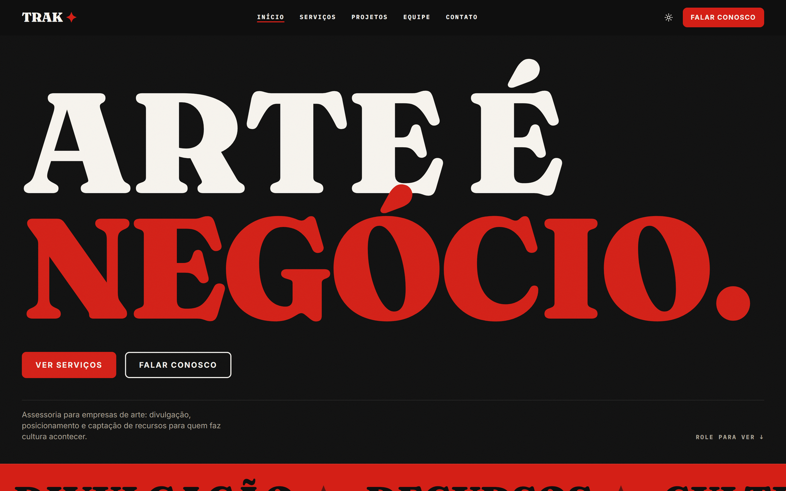
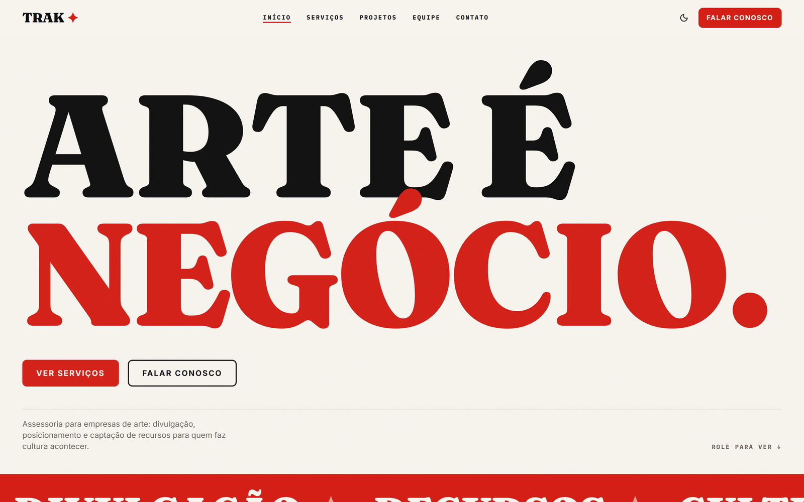
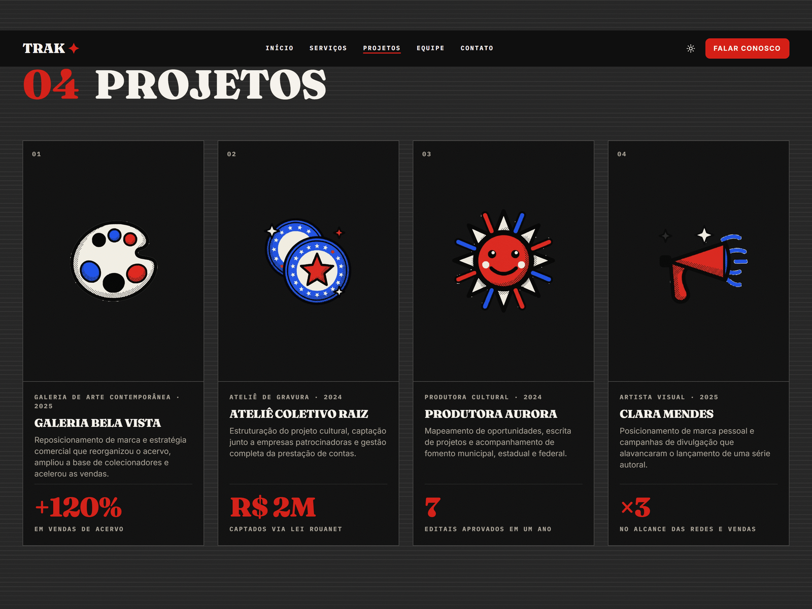
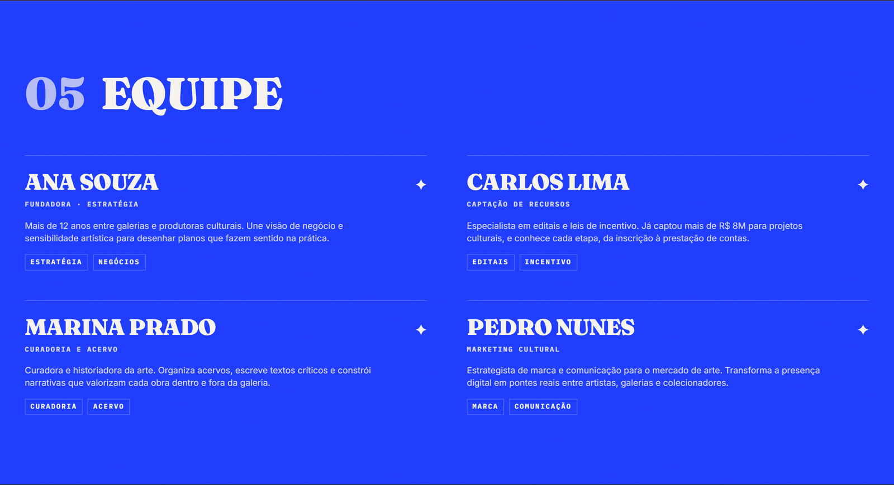
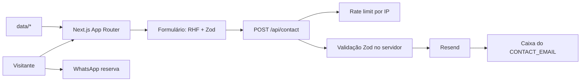

# Trak-Acessoria

Landing page one-page de uma assessoria do mercado de arte, feita com Next.js 16 e App Router.

[](https://github.com/tavinholoco/Trak-Acessoria/actions/workflows/ci.yml)


[English](README.md) | **Português**

**Site publicado:** https://trak-assessoria.vercel.app

## Índice

- [Prévia](#prévia)
- [Sobre](#sobre)
- [Funcionalidades](#funcionalidades)
- [Stack](#stack)
- [Arquitetura](#arquitetura)
- [Estrutura do projeto](#estrutura-do-projeto)
- [Como rodar](#como-rodar)
- [Scripts](#scripts)
- [Testes](#testes)
- [Deploy](#deploy)
- [Roadmap](#roadmap)
- [Licença](#licença)
- [Autor](#autor)

## Prévia

| Tema escuro (padrão) | Tema claro |
| --- | --- |
|  |  |





## Sobre

Negócios de arte (galerias, ateliês, produtoras culturais, curadores e artistas que se
organizam como empresa) raramente carecem de talento. O que falta é estrutura comercial:
alguém para posicionar a marca, cuidar da divulgação e ganhar editais. A Trak Assessoria
é a assessoria que vende exatamente isso, e este repositório é a landing page dela.

A página tem uma única função: transformar visitante em conversa. Tudo acontece em um
scroll só, dividido em blocos-pôster numerados (serviços, cases com métricas, equipe,
dúvidas e contato), para que o lead leia a oferta inteira de cima a baixo e chegue ao
formulário sem trocar de página. O formulário valida no navegador e de novo no servidor,
envia pelo Resend e cai para o WhatsApp quando e-mail não é opção.

A linguagem visual é editorial e barulhenta de propósito: display Fraunces em escala
gigante, marquee infinito, color blocking por seção e ilustrações SVG autorais. Essa
soltura fica presa pela engenharia em volta: TypeScript strict, gate de cobertura,
auditoria WCAG AA dentro da suíte end-to-end e CSP declarada no `next.config.ts`.

Este é um projeto pessoal de portfólio. A empresa, as pessoas, as métricas, o e-mail e o
telefone são dados fictícios de demonstração. A especificação completa do produto está
em [`PRD.md`](PRD.md).

## Funcionalidades

- Navegação one-page por âncoras: Início, Serviços, Projetos, Equipe, Contato.
- Seções em bloco-pôster numeradas de 03 a 07: grid de seis serviços, cases com métricas
  em destaque, equipe em lista editorial, dúvidas em accordion e o bloco de contato.
- Formulário de contato com validação Zod no cliente e no servidor, envio pelo Resend,
  rate limit por IP e feedback em toast.
- Botão de WhatsApp como canal reserva, abrindo com mensagem pré-preenchida.
- Dark mode como padrão, persistido entre visitas, com a página inteira escura: as seções
  neutras variam por um degrau discreto e o ritmo vem da cor da marca.
- Animações que respeitam `prefers-reduced-motion`: marquee, parallax leve, hover
  exagerado e reveal on scroll.
- SEO técnico: metadados, Open Graph e Twitter cards, `sitemap.xml` e `robots.txt`
  gerados, além de dados estruturados JSON-LD (Organization e ProfessionalService).
- Acessibilidade WCAG AA: navegação por teclado, contraste AA e auditorias axe-core
  rodando na suíte E2E em quatro alvos de navegador.
- LGPD: política de privacidade em `/privacidade` e barra de consentimento que só libera
  o analytics depois do aceite.
- Headers de segurança declarados no `next.config.ts`: CSP com allowlist explícito, mais
  `X-Frame-Options`, `Referrer-Policy` e `Permissions-Policy`.
- Página 404 estilizada como pôster da marca.
- Todo o conteúdo isolado em `data/*`, então mudar texto nunca encosta em componente.

## Stack

| Camada | Tecnologias |
| --- | --- |
| Frontend | Next.js 16.2 (App Router), React 19.2, TypeScript 5.9 (strict), Tailwind CSS 4.3, shadcn/ui, Base UI 1.6, lucide-react 1.28, next-themes 0.4 |
| Backend | Route Handler do Next.js (`POST /api/contact`), Zod 4.4, rate limit por IP em memória, Resend 6.18 |
| Conteúdo | Módulos tipados em `data/*`, sem CMS e sem banco de dados |
| Qualidade | Vitest 4.1, Testing Library, jsdom 29, Playwright 1.62, axe-core 4.12, ESLint 9.39 |
| Infra | Vercel, GitHub Actions, Vercel Speed Insights 2.0 |

## Arquitetura



A página em si é estática: cada seção é um server component que lê conteúdo tipado de
`data/*`, então nada vem de banco. O único caminho dinâmico é o formulário de contato.
Ele valida no navegador com React Hook Form e Zod, faz POST em `/api/contact`, e o Route
Handler roda o mesmo schema de novo no servidor, atrás de um rate limit por IP e de um
limite de 10 KB no corpo. O Resend entrega a mensagem. Sem `RESEND_API_KEY`, o handler
devolve erro controlado e o botão de WhatsApp segue como canal reserva.

## Estrutura do projeto

```
Trak-Acessoria/
├── app/
│   ├── layout.tsx              # Fontes, ThemeProvider, Header e Footer
│   ├── page.tsx                # Página única, compõe os blocos-pôster
│   ├── globals.css             # Tailwind v4 e tokens CSS
│   ├── not-found.tsx           # 404 estilizado
│   ├── sitemap.ts, robots.ts   # Sitemap e robots gerados
│   ├── privacidade/            # Política de privacidade (LGPD)
│   ├── storyboard/             # Galeria de componentes, só em desenvolvimento
│   └── api/contact/route.ts    # POST /api/contact
├── components/
│   ├── ui/                     # Primitivos do shadcn/ui
│   ├── layout/                 # Header, menu mobile, footer, barra de consentimento, analytics
│   └── sections/               # Hero, marquee, services, projects, team, faq, contact
├── data/                       # Todo o conteúdo editável, um módulo por seção
├── lib/                        # utils, seo (JSON-LD), analytics, contact, rate limit, schemas
├── hooks/                      # Scroll depth, scroll position, reduced motion, section observer
├── e2e/                        # Specs do Playwright: smoke, seo, consent, privacidade
├── docs/assets/                # Screenshots usados neste README
├── PRD.md                      # Especificação completa do produto
├── FASE-6.md                   # Checklist final de QA e deploy
└── AGENTS.md                   # Aviso de breaking changes do Next.js 16 para agentes
```

O conteúdo vive inteiro em `data/`, um arquivo por seção: `site.ts` (nome, tagline,
dados de contato, navegação e redes), `services.ts`, `projects.ts`, `team.ts`, `faq.ts`,
`marquee.ts` e `privacidade.ts`. Editar texto é editar esses arquivos, nunca um
componente.

## Como rodar

### Pré-requisitos

| Ferramenta | Versão | Como verificar |
| --- | --- | --- |
| Node.js | 22 ou mais recente, declarado em `engines` | `node --version` |
| npm | 10 ou mais recente, vem com o Node | `npm --version` |

### Instalação

```bash
git clone https://github.com/tavinholoco/Trak-Acessoria.git
cd Trak-Acessoria
npm install
cp .env.example .env.local
npm run dev
```

O site sobe em http://localhost:3000. A galeria de componentes fica em
http://localhost:3000/storyboard, só em desenvolvimento.

### Variáveis de ambiente

Copie `.env.example` para `.env.local` e preencha. O `.env.local` está no `.gitignore` e
nunca deve ser commitado.

| Variável | Descrição | Obrigatória |
| --- | --- | --- |
| `RESEND_API_KEY` | Chave da API do Resend. Sem ela o formulário ainda valida, mas o envio devolve erro controlado | Sim, para enviar e-mail |
| `CONTACT_EMAIL` | Caixa que recebe os contatos. Cai para o endereço padrão em `lib/contact.ts` | Não |
| `RESEND_FROM` | Remetente verificado no Resend. Cai para `onboarding@resend.dev` | Não |
| `NEXT_PUBLIC_SITE_URL` | URL pública usada em canonical, sitemap e Open Graph | Não |
| `NEXT_PUBLIC_ANALYTICS` | Use `plausible` para ativar o analytics, condicionado ao consentimento LGPD | Não |
| `NEXT_PUBLIC_ANALYTICS_DOMAIN` | Domínio cadastrado no provider de analytics | Não |
| `NEXT_PUBLIC_ANALYTICS_SCRIPT_URL` | URL do script do provider, para Plausible self-hosted | Não |

## Scripts

| Comando | O que faz |
| --- | --- |
| `npm run dev` | Servidor de desenvolvimento em http://localhost:3000 |
| `npm run build` | Build de produção |
| `npm run start` | Serve a build de produção |
| `npm run lint` | ESLint |
| `npm run typecheck` | Checagem de tipos, sem emitir arquivos |
| `npm test` | Testes unitários e de componente em watch mode |
| `npm run test:run` | Testes unitários e de componente, uma execução |
| `npm run test:coverage` | Testes mais relatório de cobertura, com o gate de limites |
| `npm run test:e2e` | Suíte Playwright nos quatro alvos de navegador |
| `npm run test:e2e:ui` | Playwright em UI mode, para debug interativo |
| `npm run test:e2e:report` | Abre o relatório HTML da última execução |

## Testes

| Camada | Ferramenta | O que cobre |
| --- | --- | --- |
| Unitário | Vitest com jsdom | `data/*`, helpers de `lib/*`, hooks, schemas Zod e o Route Handler com Resend mockado |
| Componente | Testing Library, jest-dom, user-event | Comportamento e acessibilidade dos componentes |
| E2E | Playwright com axe-core | Navegação por âncoras, dark mode, menu mobile, formulário, consentimento LGPD e auditoria WCAG AA |

A suíte unitária e de componente tem **132 testes em 33 arquivos**, todos passando na
última execução local. A suíte E2E tem **18 specs**, cada uma executada em quatro
projetos do Playwright: Chromium, Firefox, WebKit e viewport mobile de 375px.

```bash
npm run test:run

npx playwright install
npm run test:e2e
```

O E2E faz o build e sobe o app na porta 3100, então nunca conflita com o `npm run dev`
na porta 3000.

A cobertura tem gate no `vitest.config.mts` em 80% de statements, 70% de branches, 80%
de functions e 85% de lines. A verificação completa antes de abrir um pull request:

```bash
npm run lint && npm run typecheck && npm run test:run && npm run test:coverage
```

## Deploy

O CI roda a cada push em `main` ou `master` e em todo pull request, definido em
[`.github/workflows/ci.yml`](.github/workflows/ci.yml):

- **quality:** `npm ci`, `npm run lint`, `npm run typecheck`, `npm run test:run`,
  `npm run test:coverage`
- **e2e:** `npm ci`, instala Chromium, Firefox e WebKit, depois `npx playwright test`,
  subindo o relatório HTML do Playwright como artefato quando o job falha

O site está hospedado na Vercel em https://trak-assessoria.vercel.app. O Next.js é
detectado automaticamente, então vale o build command padrão. As variáveis de ambiente
acima precisam estar configuradas em Production e Preview nas configurações do projeto.
O checklist completo de publicação está em [`FASE-6.md`](FASE-6.md).

## Roadmap

- [x] Landing one-page com as sete seções
- [x] Formulário de contato com envio pelo Resend e rate limiting
- [x] Dark mode, suporte a reduced motion e auditoria WCAG AA
- [x] SEO técnico, JSON-LD, consentimento LGPD e política de privacidade
- [x] CI com lint, typecheck, gate de cobertura e E2E cross-browser
- [ ] Blog em MDX para SEO de conteúdo
- [ ] Páginas individuais por serviço
- [ ] Integração com CRM (HubSpot ou Sheets) no envio do formulário
- [ ] Multi-idioma
- [ ] CMS headless (Sanity ou Contentlayer) para o cliente editar sozinho
- [ ] CSP com nonce via middleware, removendo o `unsafe-inline`

## Licença

Distribuído sob a licença MIT. Veja [LICENSE](LICENSE) para detalhes.

## Autor

**Pedro Levi Dias**, Desenvolvedor Fullstack

[GitHub](https://github.com/tavinholoco) · [LinkedIn](https://www.linkedin.com/in/pedro-levi-dias-96720126a/) · [Portfólio](https://portfolio-tau-five-f86nc5khr8.vercel.app/)
